# Carvera Spindle Controller

[](https://github.com/Cloud-Badger/Carvera-Spindle-Controller/actions/workflows/ci.yml)

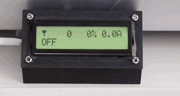

Raspberry Pi Pico 2 firmware for interfacing a Makera Carvera CNC with an ESCON 50/5 servo motor controller.

## Why This Project? (vs. DFR1036 Approach)

There's an excellent [Instructables guide](https://www.instructables.com/Carvera-Spindle-Power-Upgrade-Stock-Motor/) that uses a DFR1036 PWM-to-analog converter (~£7) with the ESCON. That's a simpler approach that works well. So why use a Pico instead?

| Feature | DFR1036 Approach | This Project |
|---------|------------------|--------------|
| Cost | ~£7 | ~£4.50 ([Pico 2](https://thepihut.com/products/raspberry-pi-pico-2)), +£12.50 if [LCD](https://thepihut.com/products/rgb-backlight-positive-lcd-16x2-extras) + £10.37 ([buck converter](https://www.amazon.co.uk/dp/B07XLJXXZ2)) |
| Complexity | Simple, passive | More complex, active |
| Display | None | Optional LCD with live status |
| Stall detection | None | Yes, with debounce |
| Overcurrent warning | None | Yes (via LCD if installed) |
| Feedback to Carvera | Via ESCON (4 ppr) | Via ESCON (4 ppr, wired direct) |
| Customization | Limited | Fully programmable |

**Choose the DFR1036 approach if**: You want simplicity and "just works" with minimal parts.

**Choose this project if**: You want a display showing what's happening, stall detection, visual warnings, or the ability to customize behavior.

## Is This Project For You?

- [x] You have a Makera Carvera CNC
- [x] You're adding an ESCON 50/5 servo controller
- [x] You have (or can get) a Raspberry Pi Pico 2
- [x] You're comfortable with basic soldering
- [x] You want stall detection and control
- [x] You want a real-time readout of spindle speed
- [x] The thought of your spindle being ~9 RPM off because the Carvera can't quite express the right duty cycle keeps you up at night ([there's a calibration system for that](docs/carvera_calibration_analysis.md))

> **⚠️ Carvera configuration required before use.** This project needs the [Carvera Community Firmware](https://github.com/Carvera-Community/Carvera_Community_Firmware) and several config changes (open-loop PWM mode, alarm pin, 20kHz PWM). The stock firmware will not work. **See [Carvera Firmware Configuration](#carvera-firmware-configuration-required) for what to change**, or [docs/CARVERA_CONFIG.md](docs/CARVERA_CONFIG.md) for step-by-step instructions.

## What It Does

```
Carvera PWM (0-100%)  -->  Pico 2  -->  ESCON PWM (10-90%)
                                   -->  Enable Signal
                                   -->  Error Output (stall/alert)

ESCON DOUT (4 PPR)  ----direct---->  Carvera Encoder Input
```

- Reads PWM duty cycle from Carvera (0-100% at 20kHz)
- Outputs clamped PWM to ESCON (10-90% range)
- Controls enable signal (HIGH when spindle commanded >=10%)
- ESCON digital output wired directly to Carvera encoder input (4 PPR)
- Detects stalls by comparing actual vs requested speed
- **Optional:** HD44780 16x2 LCD with RGB backlight shows live spindle status
- Hardware watchdog resets to safe state if firmware hangs

---

## Hardware Required

- **Raspberry Pi Pico 2** (RP2350)
- **ESCON 50/5** servo controller
- Hookup wires

> **Tip:** [Wago 221 lever connectors](https://www.wago.com/gb/lp-221) are handy for wire-to-wire connections — no soldering or crimping needed.

**Optional extras (for LCD):**
- **[HD44780 16x2 LCD with RGB backlight](https://thepihut.com/products/rgb-backlight-positive-lcd-16x2-extras)** - live spindle status display (usually includes a 10K contrast potentiometer)
- **[DC-DC buck converter](https://www.amazon.co.uk/dp/B07XLJXXZ2)** 48V to 5V - powers the LCD from the ESCON's 48V supply

> **Note:** The LCD is entirely optional. The firmware runs fine without it - spindle control works identically with or without a display connected.

---

## Quick Start

> **Prerequisites**: Rust toolchain and the embedded target must be installed. See the [Building](#building) section below for installation instructions.

### 1. Configure Carvera for Open-Loop Mode

Follow the instructions in [docs/CARVERA_CONFIG.md](docs/CARVERA_CONFIG.md) to configure your Carvera for open-loop PWM mode. This must be done before the Pico firmware will work correctly.

### 2. Wire It Up

| Pico 2 | Signal | Connects To | Voltage |
|--------|--------|-------------|---------|
| GPIO3 | PWM In | Carvera PWM Out | 5V in (OK) |
| GPIO4 | PWM Out | ESCON J5-1 (DIN1) | 3.3V out |
| GPIO5 | Enable | ESCON J5-2 (DIN2) | 3.3V out |
| GPIO10 | Error | Carvera Error In | 3.3V out |
| VSYS | Power | Carvera Shaft +5V | 5V in |
| GND | Ground | ESCON J5-5 / Carvera Shaft GND | - |

> **Speed feedback**: ESCON DOUT is wired directly to Carvera's encoder input (4 PPR).

### 3. Build and Flash

```bash
# Build
cargo build --release

# Flash (hold BOOTSEL on Pico while connecting USB)
picotool load -u -v -x -t elf target/thumbv8m.main-none-eabihf/release/carvera_spindle
```

### 4. Verify

LED should blink slowly (~1Hz). When you command spindle speed from Carvera, LED blinks fast (~4Hz).

---

## LCD Display (Optional)

The 16x2 character LCD with RGB backlight provides at-a-glance spindle status. **The LCD is entirely optional** - the firmware runs identically with or without it connected. Skip this section if you don't want a display.

### Display Format

```
i18000 -82% 5.1A
OK
```

**Line 1:**
- Position 0: Custom speed icon (tachometer)
- Positions 1-5: Target RPM (right-aligned)
- Positions 7-10: Speed deviation percentage with sign (+/-)
- Positions 12-15: Current draw (X.XA format)

**Line 2:**
- Status message: `OK`, `STALL`, or `ALERT`
- Warning messages when deviation exceeds +/-99%

### Backlight Color Significance

The RGB backlight color indicates spindle health at a glance:

| Color | Condition |
|-------|-----------|
| **Dim Green** | Spindle off (idle) |
| **Bright Green** | Normal operation (current <60%, deviation <20%) |
| **Yellow** | Warning (current 60-80% OR deviation 20-35%) |
| **Orange** | High warning (current 80-90% OR deviation 35-50%) |
| **Red** | Critical (current >90% OR deviation >50%, or STALL/ALERT) |

### Example Display States

| State | Line 1 | Line 2 | Backlight |
|-------|--------|--------|-----------|
| Spindle Off | `i    0  +0% 0.0A` | `OK` | Dim green |
| Normal Running | `i12000  +2% 2.1A` | `OK` | Bright green |
| Speed Warning | `i12000 -35% 3.0A` | `OK` | Yellow |
| Stall Detected | `i12000 -99% 4.5A` | `STALL` | Red |
| Overcurrent | `i 8000  +5% 4.2A` | `OK` | Orange |
| Alert State | `i12000 -50% 5.0A` | `ALERT` | Red |

---

## Complete Wiring Guide

### Voltage Levels - Don't Panic!

The Carvera outputs 5V PWM, but the Pico 2 runs at 3.3V. **This is fine!**
- The RP2350's GPIO pins are 5V-tolerant on inputs
- The Pico outputs 3.3V, which the ESCON accepts (anything >2.4V is "HIGH")
- No level shifters needed

### Signal Voltage Summary

| Signal | From -> To | Voltage | Notes |
|--------|-----------|---------|-------|
| PWM Command | Carvera -> Pico | **5V** | RP2350 is 5V tolerant |
| PWM Set Value | Pico -> ESCON | 3.3V | ESCON accepts >2.4V as HIGH |
| Enable | Pico -> ESCON | 3.3V | ESCON accepts >2.4V as HIGH |
| Speed Feedback | ESCON -> Carvera | 3.3V/5V | Direct wire |
| Error Out | Pico -> Carvera | 3.3V | Carvera accepts 3.3V |
| ESCON Alert | ESCON -> Pico | 3.3V/5V | Either works, RP2350 tolerant |
| ESCON Speed | ESCON -> Pico | 3.3V/5V | Either works, RP2350 tolerant |
| Current | ESCON -> Pico | 0-4V | Readings above 3.3V will clip at ADC max |

### Complete Wiring Table

| Pico 2 Pin | Wire Color | Connects To          | Signal         | Direction | Voltage |
|------------|------------|----------------------|----------------|-----------|---------|
| VSYS (39)  | Red        | Carvera Shaft +5V    | Power +5V      | In        | 5V |
| GND (38)   | Black      | Carvera Shaft GND    | Power GND      | -         | - |
| GPIO3 (5)  | Green      | Carvera PWM Out      | PWM Input      | In        | 5V |
| GPIO4 (6)  | Yellow     | ESCON J5 Pin 1       | PWM Set Value  | Out       | 3.3V |
| GPIO5 (7)  | Blue       | ESCON J5 Pin 2       | Enable         | Out       | 3.3V |
| GPIO8 (11) | Purple     | ESCON Error Out      | Alert Input (active-low, Pull-Up) | In | 3.3-5V |
| GPIO9 (12) | Gray       | ESCON Speed Out      | Speed Input    | In        | 3.3-5V |
| GPIO10 (14)| White      | Carvera Error In     | Error Output   | Out       | 3.3V |
| GPIO25     | (onboard)  | Onboard LED          | Status LED     | Out       | 3.3V |
| GPIO26 (31)| Pink       | ESCON Current Out    | ADC Input      | In        | 0-4V |
| GND (3)    | Black      | ESCON J5 Pin 5       | Signal Ground  | -         | - |

### LCD Wiring (HD44780 16x2 with RGB Backlight) - Optional

Skip this section if you're not using an LCD. The firmware works fine without it.

The LCD uses two groups of connections: data/control and power/RGB.

**Important**: This LCD has a **common anode** RGB backlight. PWM is **inverted**: LOW = LED ON, HIGH = LED OFF.

| Pico 2 Pin | LCD Pin | Signal | Notes |
|------------|---------|--------|-------|
| GPIO16 (21) | Pin 4 | RS | Register Select |
| GPIO17 (22) | Pin 6 | E | Enable |
| GPIO18 (24) | Pin 11 | D4 | Data bit 4 |
| GPIO22 (29) | Pin 12 | D5 | Data bit 5 |
| GPIO20 (26) | Pin 13 | D6 | Data bit 6 |
| GPIO21 (27) | Pin 14 | D7 | Data bit 7 |
| GPIO14 (19) | Pin 16 | Red- | Red LED cathode (PWM) |
| GPIO12 (16) | Pin 17 | Green- | Green LED cathode (PWM) |
| GPIO13 (17) | Pin 18 | Blue- | Blue LED cathode (PWM) |
| Buck converter 5V | Pin 2, 15 | VDD, LED+ | Power and LED common anode (from buck converter, not Pico) |
| Buck converter GND | Pin 1, 5 | VSS, R/W | Ground and write mode |

### Contrast Potentiometer

Connect a 10K potentiometer between the buck converter 5V and GND, with the wiper going to LCD Pin 3 (V0):

```
    Buck Conv 5V
          |
         [1]
    10K  [2]-----> LCD Pin 3 (V0)
   POT   [3]
          |
        GND
```

Adjust for best contrast - turn clockwise for darker text.

### Pico 2 Pinout Diagram

```
                      USB
                  +-------+
            GP0  -| 1  40 |- VBUS
            GP1  -| 2  39 |- VSYS (5V power in)
            GND  -| 3  38 |- GND
            GP2  -| 4  37 |- 3V3_EN
  (PWM IN)  GP3  -| 5  36 |- 3V3
  (PWM OUT) GP4  -| 6  35 |- ADC_VREF
  (ENABLE)  GP5  -| 7  34 |- GP28
            GND  -| 8  33 |- GND
            GP6  -| 9  32 |- GP27
            GP7  -| 10 31 |- GP26 (ADC)
  (ALERT)   GP8  -| 11 30 |- RUN
  (SPEED)   GP9  -| 12 29 |- GP22 (LCD D5)
            GND  -| 13 28 |- GND
  (ERROR)   GP10 -| 14 27 |- GP21 (LCD D7)
  (LCD R)   GP11 -| 15 26 |- GP20 (LCD D6)
  (LCD G)   GP12 -| 16 25 |- GP19
  (LCD B)   GP13 -| 17 24 |- GP18 (LCD D4)
            GND  -| 18 23 |- GND
            GP14 -| 19 22 |- GP17 (LCD E)
            GP15 -| 20 21 |- GP16 (LCD RS)
                  +-------+
```

### Powering the Pico 2

The Pico is powered from the Carvera's shaft connector (the same 5V supply used in the [Instructables DFR1036 approach](https://www.instructables.com/Carvera-Spindle-Power-Upgrade-Stock-Motor/)):

```
Carvera Shaft +5V ---+--- VSYS (Pin 39)
                     |
Carvera Shaft GND ---+--- GND (Pin 38)
```

### Powering the LCD (Optional)

The LCD requires more current than the Pico's 3.3V output can reliably supply. A [DC-DC buck converter](https://www.amazon.co.uk/dp/B07XLJXXZ2) (48V to 5V) is wired to the ESCON's 48V power supply:

```
ESCON 48V Supply ---+--- Buck Converter IN+
                    |
ESCON GND ----------+--- Buck Converter IN-

Buck Converter OUT+ ---+--- LCD Pin 2 (VDD)
                       +--- LCD Pin 15 (LED+)
                       |
Buck Converter OUT- ---+--- LCD Pin 1 (VSS)
                       +--- LCD Pin 5 (R/W)
```

---

## ESCON Studio Configuration

Complete ESCON 50/5 configuration using ESCON Studio (Motion Studio 1.1). Connect the ESCON to your PC via USB, open ESCON Studio, and configure each section as shown below.

> **A note on screenshot quality:** These are photos of an LCD monitor, not proper screenshots — hence the moiré patterns and general sadness. Unfortunately they can't be retaken, because the ESCON's USB port was ripped clean off the PCB (see [Act V](#things-you-should-absolutely-not-do-learned-by-experience)).

### 1. Motor/Sensors > Motor

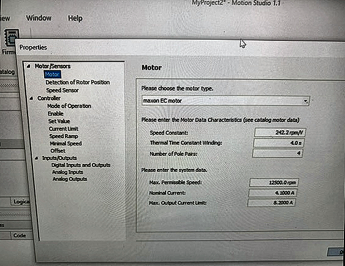

| Setting | Value |
|---------|-------|
| Motor Type | maxon EC motor |
| Speed Constant | 242.2 rpm/V |
| Thermal Time Constant Winding | 4.0 s |
| Number of Pole Pairs | 4 |
| Max. Permissible Speed | 12500.0 rpm |
| Nominal Current | 4.1000 A |
| Max. Output Current Limit | 8.2000 A |

### 2. Motor/Sensors > Detection of Rotor Position

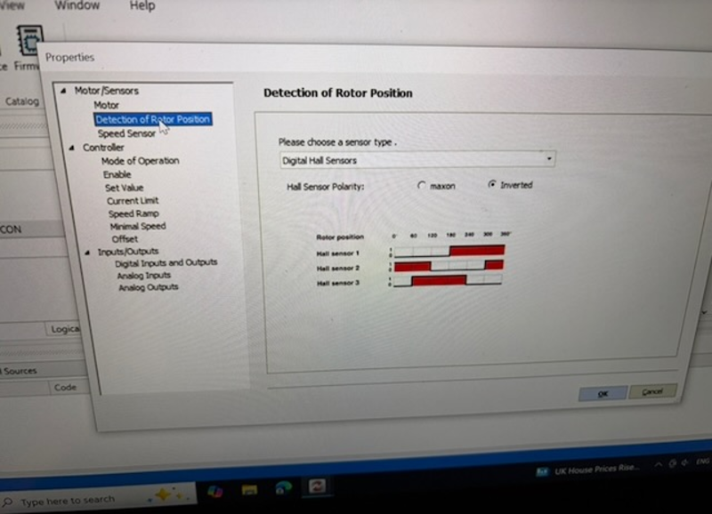

| Setting | Value |
|---------|-------|
| Sensor Type | Digital Hall Sensors |
| Hall Sensor Polarity | **Inverted** |

### 3. Motor/Sensors > Speed Sensor

Uses the available Hall Sensors (configured in step 2). No additional settings needed.

### 4. Controller > Mode of Operation

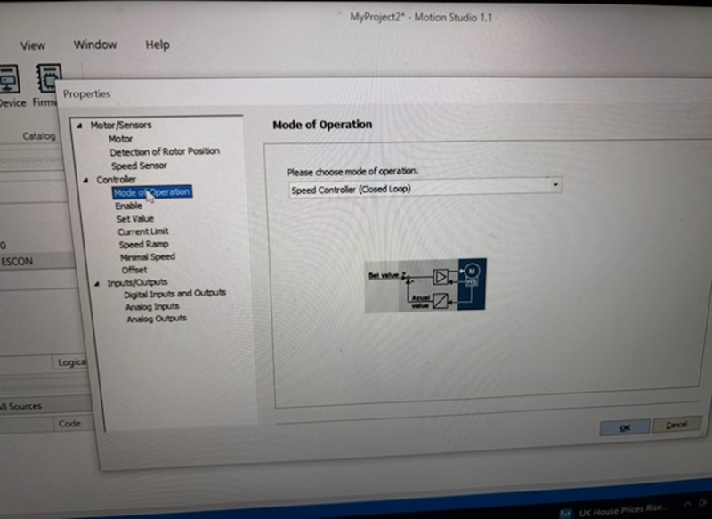

| Setting | Value |
|---------|-------|
| Mode | **Speed Controller (Closed Loop)** |

The ESCON handles closed-loop speed regulation internally. The Pico sends an open-loop PWM command, and the ESCON's own PID controller maintains the target speed.

### 5. Controller > Enable

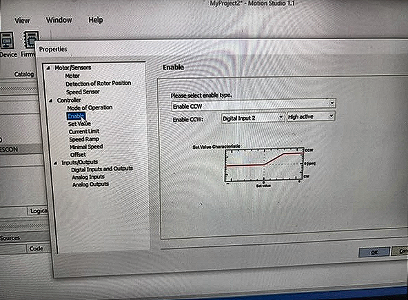

| Setting | Value |
|---------|-------|
| Enable Type | Enable CCW |
| Enable CCW Input | Digital Input 2 |
| Enable CCW Logic | **High active** |

The Pico drives GPIO5 HIGH to enable the motor. "CCW" refers to the default rotation direction — the motor spins when DIN2 is HIGH.

### 6. Controller > Set Value

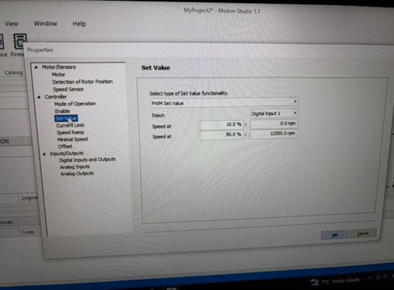

| Setting | Value |
|---------|-------|
| Type | PWM Set Value |
| Input | Digital Input 1 |
| Speed at 10.0% | **0.0 rpm** |
| Speed at 90.0% | **12500.0 rpm** |

The ESCON maps the incoming PWM duty cycle (10-90%) linearly to the speed range. The Pico firmware clamps its output to this 10-90% range to match.

### 7. Controller > Current Limit

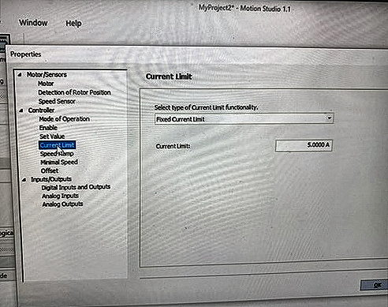

| Setting | Value |
|---------|-------|
| Type | Fixed Current Limit |
| Current Limit | **5.0000 A** |

### 8. Controller > Speed Ramp

| Setting | Value |
|---------|-------|
| Type | Fixed Ramp |
| Acceleration | 5000.0 rpm/s |
| Deceleration | 5000.0 rpm/s |

### 9. Controller > Minimal Speed

| Setting | Value |
|---------|-------|
| Minimal Speed | 0.0 rpm |

### 10. Controller > Offset

| Setting | Value |
|---------|-------|
| Type | Fixed Offset |
| Offset | 0.0 rpm |

### 11. Inputs/Outputs > Digital Inputs and Outputs

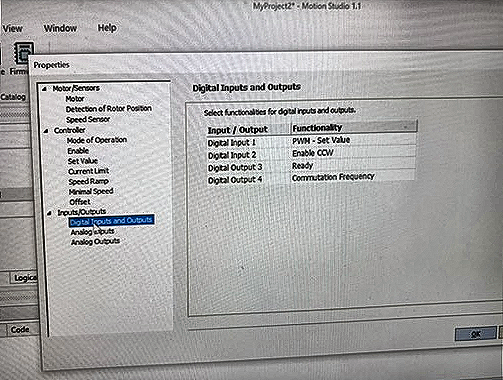

| Input / Output | Functionality | Notes |
|----------------|---------------|-------|
| Digital Input 1 | PWM - Set Value | Pico GPIO4 -> ESCON J5-1 |
| Digital Input 2 | Enable CCW | Pico GPIO5 -> ESCON J5-2 |
| Digital Output 3 | Ready | ESCON -> Pico GPIO8 (alert input) |
| Digital Output 4 | Commutation Frequency | ESCON -> Carvera encoder input (4 PPR) |

#### Digital Output 3: Ready (Low active)

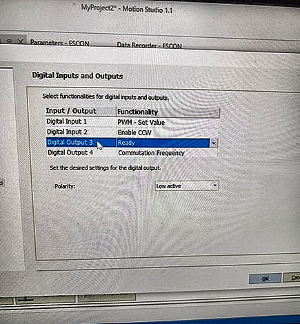

| Setting | Value |
|---------|-------|
| Functionality | Ready |
| Polarity | **Low active** |

DOUT3 is wired to Pico GPIO8 as an alert signal. **Low active** means the output is LOW when the ESCON is ready (normal), and HIGH when there's an error. The Pico reads this with a pull-up — a HIGH on GPIO8 triggers the ALERT state.

#### Digital Output 4: Commutation Frequency

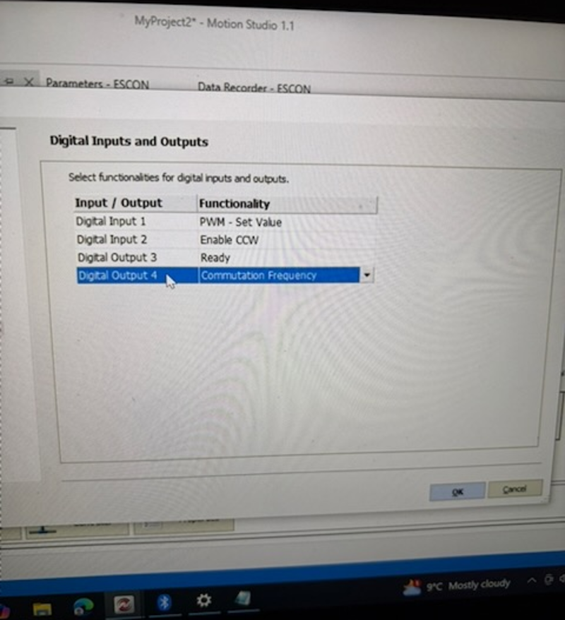

| Setting | Value |
|---------|-------|
| Functionality | Commutation Frequency |

DOUT4 outputs 4 pulses per revolution. This is wired directly to the Carvera's encoder input so it can track spindle speed for feedback.

### 12. Inputs/Outputs > Analog Inputs

All analog inputs are set to **None** (not used).

### 13. Inputs/Outputs > Analog Outputs

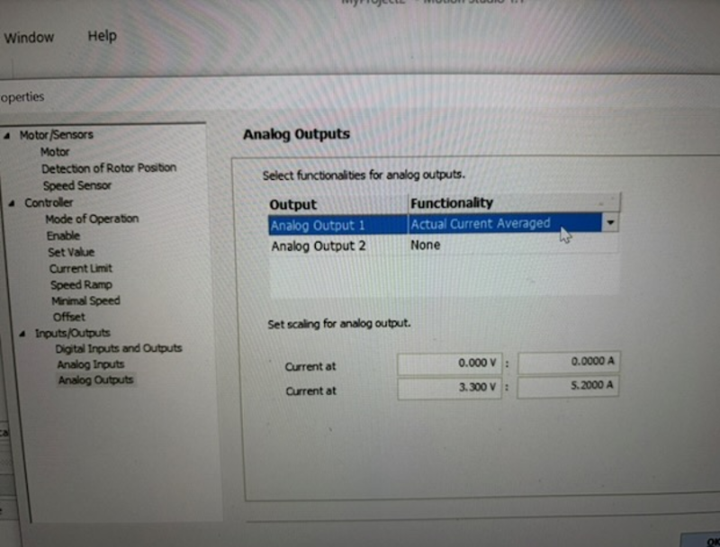

| Output | Functionality | Scaling |
|--------|---------------|---------|
| Analog Output 1 | Actual Current Averaged | 0.000V = 0.0000A, 3.300V = **5.2000A** |
| Analog Output 2 | None | — |

Analog Output 1 is wired to Pico GPIO26 (ADC) for current monitoring. The scaling means 3.3V corresponds to 5.2A, which matches `CURRENT_AT_3V3_MA` in the firmware.

> **Note**: The ESCON can output up to 4V, but the RP2350 ADC accepts 0-3.3V. Readings above 3.3V clip at the ADC maximum, but current monitoring still works for typical operating ranges.

### 14. Save Configuration

1. Click **Download All Parameters** to write settings to the ESCON
2. Power cycle the ESCON to apply changes

### ESCON Configuration Summary

| Setting | Value |
|---------|-------|
| Motor Type | maxon EC motor, 4 pole pairs |
| Max Speed | 12500 rpm |
| Hall Sensor Polarity | Inverted |
| Mode of Operation | Speed Controller (Closed Loop) |
| Enable | DIN2, High active |
| PWM Set Value | DIN1, 10%=0rpm, 90%=12500rpm |
| Current Limit | 5.0A (fixed) |
| Speed Ramp | 5000 rpm/s (accel & decel) |
| DOUT3 | Ready, Low active (alert to Pico) |
| DOUT4 | Commutation Frequency (feedback to Carvera) |
| Analog Out 1 | Actual Current Averaged, 3.3V=5.2A |

---

## Configurable Values

These constants in `src/state.rs` **MUST match your ESCON Studio configuration**:

| Constant | Default | Description |
|----------|---------|-------------|
| `MIN_RPM` | 0 | Speed at 10% PWM duty (ESCON setting) |
| `MAX_RPM` | 12500 | Speed at 90% PWM duty (ESCON setting) |
| `CURRENT_AT_3V3_MA` | 5200 | Current in mA corresponding to 3.3V ADC reading |
| `STALL_THRESHOLD_PCT` | 30 | Stall if actual < N% of requested |
| `OVERCURRENT_THRESHOLD_PCT` | 90 | Overcurrent if current > N% of max |

### Changing ESCON Configuration

If you change the speed range in ESCON Studio:
1. Update `MIN_RPM` and `MAX_RPM` in `src/state.rs`
2. Rebuild: `cargo build --release`
3. Flash to device (see below)
4. Verify LCD shows correct values on startup

---

## Building

```bash
# Install Rust (if not already installed)
curl --proto '=https' --tlsv1.2 -sSf https://sh.rustup.rs | sh

# Add the embedded target
rustup target add thumbv8m.main-none-eabihf

# Build release binary
cargo build --release

# Verify binary is correct (should show "RP2350" and "ARM Secure")
picotool info target/thumbv8m.main-none-eabihf/release/carvera_spindle -t elf
```

## Flashing (Use picotool, NOT elf2uf2-rs!)

**Important**: elf2uf2-rs doesn't properly support RP2350. Use picotool instead.

### Install picotool

Install [picotool](https://github.com/raspberrypi/picotool) from the official Raspberry Pi repository:

```bash
# macOS
brew install picotool

# Linux - see official build instructions at:
# https://github.com/raspberrypi/picotool#build-instructions
```

### Flash via USB (BOOTSEL mode)

1. **Enter BOOTSEL mode**: Hold the BOOTSEL button on the Pico 2, then connect USB
2. The Pico appears as a USB mass storage device named `RP2350`
3. **Flash with picotool**:
   ```bash
   picotool load -u -v -x -t elf target/thumbv8m.main-none-eabihf/release/carvera_spindle
   ```
   Flags:
   - `-u` = skip unchanged flash sectors
   - `-v` = verify after writing
   - `-x` = execute (reboot) after flashing
   - `-t elf` = input is ELF format

4. The Pico will reboot automatically and start running

### Flash via Probe (SWD)

For development with a debug probe (Raspberry Pi Debug Probe, etc.):

1. Install probe-rs:
   ```bash
   curl --proto '=https' --tlsv1.2 -LsSf https://github.com/probe-rs/probe-rs/releases/latest/download/probe-rs-tools-installer.sh | sh
   ```

2. Connect debug probe to Pico 2 SWD pins:
   - Orange -> SWCLK
   - Yellow -> SWDIO
   - Black -> GND

3. Flash and run:
   ```bash
   probe-rs run --chip RP2350 target/thumbv8m.main-none-eabihf/release/carvera_spindle
   ```

---

## Testing

### Unit Tests

```bash
# Run unit tests
# macOS:
cargo test --lib --no-default-features --target x86_64-apple-darwin

# Linux:
cargo test --lib --no-default-features --target x86_64-unknown-linux-gnu
```

### Hardware Testing

**Pico Only (Before Wiring to ESCON/Carvera):**
1. Power on Pico 2 via USB
2. **Onboard LED should blink slowly (~1Hz)** - confirms firmware running
3. **LCD should show spindle status** - dim green backlight when idle

**Full System:**
1. Wire everything per the wiring table above
2. Power on ESCON, then Carvera
3. Command a spindle speed from Carvera (e.g. `M3 S6000`)
4. **Onboard LED should blink fast (~4Hz)** - confirms signal detected
5. Verify spindle responds correctly
6. Monitor LCD for live status and any warnings
7. Command spindle stop (`M5`) - LED should return to slow blink

---

## Status LED

| Pattern | Meaning |
|---------|---------|
| Slow blink (~1Hz) | Firmware running, waiting for signal |
| Fast blink (~4Hz) | Active signal detected |
| Solid | Error state (check LCD display) |

---

## How It Works

Think of this firmware as a small team of workers, each with one job. They all run at the same time (concurrently) but focus on their own responsibilities.

### The Workers (Tasks)

**The Signal Translator (spindle_control_task)**

Like a UN interpreter, this worker constantly listens to what the Carvera is asking for ("I want 25% speed!") and translates it into ESCON-speak ("Enable + 30% PWM"), and watches for trouble.

What it does every 20ms:
1. Reads Carvera's speed request (measured by PIO with 640-cycle averaging)
2. Applies calibration correction if available
3. Translates and sends to ESCON (GPIO4 + GPIO5)
4. Reads actual spindle speed from ESCON (GPIO9)
5. Checks for stalls or ESCON alerts (GPIO8)
6. Sets error output if something's wrong (GPIO10)

**The Dashboard Operator (lcd_task)**

Updates the 16x2 LCD so you can see what's happening without connecting a computer. Shows:
- Target RPM and deviation percentage
- Current draw
- Status (OK/STALL/ALERT)
- Color-coded backlight for quick health assessment

**The Heartbeat Light (led_task)**

Blinks the onboard LED so you know firmware is alive:
- Slow blink (~1Hz) = Waiting, no signal
- Fast blink (~4Hz) = Working, signal active
- Solid = Error state

**The Safety Inspector (watchdog_task)**

Pokes the hardware watchdog every 250ms. If this worker ever stops (because something crashed), the whole system resets to a safe state after 1 second.

### Signal Processing Pipeline

```
Carvera PWM  -->  [PIO Measure]  -->  [Calibration]  -->  [Clamp 10-90%]  -->  ESCON PWM
   (0-100%)       (640-cycle           (correction)     (ESCON range)          (10-90%)
    20kHz)         averaging,
                   ~32ms window)

ESCON DOUT  ----(direct wire)---->  Carvera Encoder Input (4 PPR)
```

### Input-to-Output Latency

| Stage | Typical | Worst Case | Notes |
|-------|---------|------------|-------|
| PIO measurement | 16ms | 32ms | 640-cycle averaging window at 20kHz |
| Control loop | 0-20ms | 20ms | Runs every 20ms, depends on phase |
| PWM output | <0.01ms | <0.01ms | Hardware peripheral, near-instant |
| **Total** | **~26ms** | **~52ms** | From Carvera duty change to ESCON output change |

### Stall Detection Logic

```
               +------------------+
               |  Speed Changed?  |
               +--------+---------+
                        |
            +-----------+-----------+
            | Yes                   | No
            v                       v
    [Reset grace period]    [Check grace period]
                                    |
                            +-------+-------+
                            | In grace?     |
                            +-------+-------+
                                    |
                    +---------------+---------------+
                    | Yes                           | No
                    v                               v
                [No stall]                  [Compare speeds]
                                                    |
                                            +-------+-------+
                                            | Actual < 30%  |
                                            | of Requested? |
                                            +-------+-------+
                                                    |
                                    +---------------+---------------+
                                    | Yes                           | No
                                    v                               v
                            [Start/continue              [Clear stall timer]
                             stall timer]
                                    |
                            +-------+-------+
                            | Timer > 100ms? |
                            +-------+-------+
                                    |
                            +-------+-------+
                            | Yes           | No
                            v               v
                      [STALL DETECTED]  [Keep waiting]
```

---

## Troubleshooting

### Quick Diagnosis

**Q: Is the firmware even running?**

Look at the onboard LED (GPIO25):
- **Blinking slowly (~1/sec)**: Running, waiting for signal
- **Blinking fast (~4/sec)**: Running, signal detected
- **Not blinking**: Firmware not running (see below)
- **Solid on**: Error state detected

### LED Won't Blink At All

**Symptom**: Plug in Pico, LED does nothing.

**Check these:**
1. **Firmware didn't flash correctly**
   - Try again with BOOTSEL held while connecting USB
   - Use `picotool info` to verify the binary is correct

2. **Wrong firmware loaded**
   - Make sure it's built for RP2350, not RP2040
   - Check: `picotool info target/thumbv8m.main-none-eabihf/release/carvera_spindle -t elf`
   - Should show "RP2350" and "ARM Secure"

3. **Power supply issue**
   - Is VSYS connected to 5V?
   - Is GND connected?

### LCD Not Working

**No display at all:**
- Check VDD (Pin 2) connected to buck converter 5V
- Check VSS (Pin 1) connected to GND
- Verify contrast pot is connected and adjusted
- Ensure R/W pin (Pin 5) is tied to GND

**Garbled or no text:**
- Double-check D4-D7 connections (GPIO18, GPIO22, GPIO20, GPIO21)
- Verify RS and E connections (GPIO16, GPIO17)
- Try adjusting contrast pot

**Backlight not working:**
- Check RGB connections to GPIO11, GPIO12, GPIO13
- Verify common anode (Pin 15) is connected to buck converter 5V

### LED Blinks, But Spindle Won't Spin

**Check in order:**

1. **Is GPIO5 (Enable) going HIGH?**
   - Measure with multimeter (~3.3V when enabled)
   - If always LOW: PWM input signal not detected

2. **Is ESCON configured for Active High enable?**
   - Check in ESCON Studio: DIN2 should be "Enable, Active High"

3. **Is the Enable wire actually connected to ESCON J5 Pin 2?**
   - Double-check wiring

4. **Is the Carvera sending PWM signal?**
   - Connect oscilloscope or logic analyzer to GPIO3
   - Should see 20kHz PWM when spindle is commanded

### Spindle Spins at Wrong Speed

**Cause**: Mismatch between firmware and ESCON settings.

**Fix:**
1. Note your ESCON Studio RPM settings (speed at 10% and 90% duty)
2. Update `MIN_RPM` and `MAX_RPM` in `src/state.rs`
3. Rebuild: `cargo build --release`
4. Re-flash: `picotool load -u -v -x -t elf target/thumbv8m.main-none-eabihf/release/carvera_spindle`
5. Verify LCD shows correct values

### "STALL" Error Appears Unexpectedly

**Possible causes:**

1. **Stall threshold too aggressive**
   - Default is 30% - spindle must reach 30% of requested speed
   - During heavy cuts, actual speed may dip below threshold
   - Increase `STALL_THRESHOLD_PCT` in `src/state.rs`

2. **Grace period too short**
   - Spindle needs time to accelerate
   - Increase `BASE_GRACE_MS` or `RPM_GRACE_FACTOR`

3. **ESCON speed feedback not connected**
   - GPIO9 must receive pulses from ESCON
   - Without this, actual_rpm always reads 0 = stall

### "ALERT" Error on LCD

**This means ESCON detected a problem.**

Common causes:
- Motor overcurrent
- Motor overtemperature
- Power supply undervoltage
- Motor disconnected

Check ESCON Studio for detailed error information.

### Spindle Doesn't Stop When Carvera Commands Stop

**Check:**

1. **Enable signal (GPIO5)**
   - Should go LOW when duty < 10%
   - Measure with multimeter

2. **PWM output (GPIO4)**
   - Should stay at 10% when disabled (fail-safe)
   - ESCON should interpret 10% as minimum/stop

### Carvera Shows "Spindle Error"

**The Carvera expects feedback pulses from the ESCON digital output.**

1. **Check ESCON DOUT connection to Carvera encoder input**
   - ESCON digital output must be wired directly to Carvera's spindle feedback input
   - ESCON outputs 4 pulses per revolution

2. **Verify Carvera config matches ESCON output**
   - `spindle.pulses_per_rev` must be set to `4` (matching ESCON's 4 PPR)
   - See [docs/CARVERA_CONFIG.md](docs/CARVERA_CONFIG.md) for configuration details

### System Resets Randomly

**This is the watchdog doing its job!**

Something is causing the firmware to hang. Possible causes:

1. **I2C/LCD timeout**
   - Display not responding can cause delays
   - The task should handle this, but check connections

2. **Stack overflow**
   - Unlikely with current task sizes
   - Check if you added code that uses lots of stack

### Building / Flashing Issues

**"Family ID 'absolute'" Error**

The binary wasn't built correctly for RP2350.

**Fix:**
- Ensure `memory.x` has the `.start_block` section
- Check `.cargo/config.toml` has correct target
- Rebuild from clean: `cargo clean && cargo build --release`

**"elf2uf2-rs doesn't work"**

This is expected. The RP2350 boot ROM requires specific image format.

**Use picotool instead:**
```bash
picotool load -u -v -x -t elf target/thumbv8m.main-none-eabihf/release/carvera_spindle
```

**"No device found"**

1. Hold BOOTSEL button while connecting USB
2. Release after connection
3. Should appear as mass storage device
4. Run picotool command

### Getting Debug Output

Connect USB while Pico is running. Use a defmt viewer:

```bash
# Install probe-rs tools
cargo install probe-rs-tools

# View logs
probe-rs attach --chip RP2350 target/thumbv8m.main-none-eabihf/release/carvera_spindle
```

### Emergency Stop

If something goes wrong:

1. **Unplug USB and turn off the Carvera** for at least 5 seconds
2. The watchdog will have already disabled the spindle after 1 second of no feed
3. ESCON should also have its own safety features

---

## Things You Should Absolutely Not Do (Learned by Experience)

> **⚠️ A cautionary tale in five acts, each less dignified than the last.**

**Act I: "I'll just swap this wire real quick"**

Made a wiring change with 48V still live. The power supply disagreed with this decision — violently. Cost: ~£50 and a week waiting for a replacement. The smoke was free.

**Act II: "Surely the Pico is fine though"**

The Pico was not fine. The same incident corrupted the flash storage, which manifested as random, inexplicable errors. Spent over a week debugging before realising the flash itself was damaged from Act I. The Pico went in the bin.

**Act III: "It won't happen again"**

It happened again. Made another hot-swap attempt (because apparently I don't learn), destroyed GPIO pins on a second Pico. At this point, the Pico 2's £4.50 price tag was the only thing preserving my dignity.

**Act IV: "I'll just solder this LCD cable nice and neat"**

Soldered up the LCD display with a lovely cable, routed it carefully through the back of the machine. Professional job. Then remembered the back panel needed to go on — which meant disconnecting everything, feeding the cables through a hole, and re-soldering. Did that. Then discovered the hole got covered by the panel mounting. Re-soldered the whole thing a third time. The LCD now works perfectly. The cable survived all three attempts. The roll of solder wick did not.

**Act V: "I'll just tighten this screw with the USB still plugged in"**

Tried to screw the ESCON controller into its mounting with a right-angled micro USB cable still plugged in — figured it would be fine. The screw forced the board up against the cable — pop. Ripped the micro USB socket clean off the ESCON board. Unplug the USB cable before screwing the ESCON in.

**The moral:** Turn the power off before touching anything. Measure twice before soldering anything. And for the love of all that is holy, check whether the panel fits before you route a single wire. The 30 seconds you save will cost you weeks of debugging and a small pile of dead components.

---

## Before Powering On - The Checklist

Before applying power, verify:

- [ ] VSYS connected to 5V (not 3.3V, not GND!)
- [ ] GND connected (most common mistake!)
- [ ] No bare wires touching each other
- [ ] Double-check GPIO numbers against table above
- [ ] ESCON configured per settings in this guide
- [ ] LCD wiring correct (especially contrast pot and R/W to GND)

**First-time power-on sequence:**

1. Power Pico via USB (easier debugging)
2. Verify LED blinks slowly (~1Hz)
3. Verify LCD shows status (dim green backlight when idle)
4. Connect ESCON power (but not motor)
5. Verify ESCON status LEDs normal
6. Connect Carvera signals
7. Test spindle command from Carvera
8. Finally, connect motor and test under load

---

## Project Structure

```
src/
+-- lib.rs          # Pure functions and unit tests
+-- main.rs         # Embedded entry point, task spawning
+-- display.rs      # Platform-agnostic display data types
+-- lcd.rs          # HD44780 LCD driver and formatting
+-- state.rs        # Configuration constants and shared state
+-- tasks/          # Embassy async tasks
|   +-- spindle_control.rs  # PWM, feedback, stall detection
|   +-- lcd.rs              # LCD display updates
|   +-- led.rs              # Status LED blinking
|   +-- watchdog.rs         # Hardware watchdog feeder
|   +-- current_monitor.rs  # ADC current monitoring
|   +-- thermal.rs          # MCU temperature monitoring (not yet integrated)
|   +-- speed_measure.rs    # T-Method speed measurement
```

---

## Hardware Specifications Reference

### RP2350 (Pico 2)

| Feature | Specification |
|---------|---------------|
| PWM | 12 slices, 2 channels each (A/B), 24 total channels |
| ADC | 12-bit, 0-3.3V range, channels on GPIO26-29 |
| GPIO | 5V tolerant on inputs (when IOVDD is 3.3V) |

### ESCON 50/5

| Feature | Specification |
|---------|---------------|
| Digital Inputs | +2.4V to +36V accepted as HIGH, 38.5kOhm impedance |
| Digital Outputs | Configurable, typically 3.3V or 5V |
| Analog Outputs | -4V to +4V range, 12-bit resolution |
| PWM Input | 10-90% duty cycle maps to speed range |

### Carvera Signals

| Signal | Specification |
|--------|---------------|
| PWM Command | 5V, 20kHz, 0-100% duty (open-loop mode) |
| Speed Feedback | Expects 4 pulses/rev (ESCON DOUT direct to Carvera), 5V logic |
| Alarm Signal | 5V when fault detected |

### HD44780 LCD (18-pin RGB version)

| Feature | Specification |
|---------|---------------|
| Display | 16 characters x 2 lines |
| Interface | 4-bit parallel mode |
| Backlight | Common anode RGB (inverted PWM) |
| Voltage | 3.3V compatible |

---

## RPM Display Precision

**Displayed RPM may differ from requested RPM by approximately ±1%.**

This is expected behavior, not a firmware bug. When you request 6000 RPM, the display might show 6057 RPM (or similar values within ~1%).

### Why This Happens

The error originates from the **Carvera's PWM signal generation**, not this firmware. The Carvera converts your requested speed to a PWM duty cycle, and this conversion has limited precision (~0.25-0.5% steps).

Example for 6000 RPM:
- Exact duty needed: 22.46%
- Carvera actually sends: ~22.73%
- This 0.27% PWM difference → 57 RPM display difference

### Why Better Firmware Math Won't Help

This firmware measures the Carvera's PWM signal with excellent precision (0.1% resolution). The measurement is accurate - the Carvera simply isn't sending exactly what we'd expect.

The ESCON motor controller also only accepts PWM in 0.1% steps, so even if the Carvera sent perfect values, there would still be some quantization at the output stage.

### Is This a Problem?

No. The ~1% variance is well within normal spindle/VFD tolerances. Most CNC applications don't require RPM accuracy better than ±2%. The actual spindle speed is controlled accurately by the ESCON - this is purely a display artifact from the input signal precision.

---

## Calibration

The firmware includes an optional calibration system that maps Carvera's PWM duty cycle to actual RPM values. Without calibration, RPM is calculated using a standard linear formula, which can be off by ~1% due to Carvera's PWM quantization. With calibration, the firmware uses a 386-point piecewise-linear lookup table for accurate duty-to-RPM conversion.

### Why Calibrate?

The Carvera converts requested RPM to a PWM duty cycle, but this conversion has limited precision (~0.25-0.5% steps). Calibration records the exact duty cycle the Carvera sends for each RPM value, allowing the firmware to reverse-map duty back to RPM with higher accuracy.

For the detailed investigations behind this approach, see:
- [Carvera Calibration Analysis](docs/carvera_calibration_analysis.md) - why the Carvera's non-linear PWM output requires a 386-point lookup table
- [ESCON Linear Formula Validation](docs/escon_calculation_validation.md) - why the ESCON side doesn't need calibration (perfectly linear)

### How to Calibrate

Calibration is triggered by running a specific G-code file that plays a 3-note "musical" trigger sequence, followed by a sweep through 386 speed steps (750 to 20,000 RPM in 50 RPM increments).

**Step 1:** Upload the calibration G-code file to your Carvera and run it:

```
docs/calibration_procedure.gcode
```

The file does the following:
1. **Trigger sequence** (6000 -> 12000 -> 9000 RPM, then stop) - the firmware detects this pattern and enters calibration mode
2. **386 speed steps** (750 to 20,000 RPM in 50 RPM increments, 0.25s each) - the firmware records the PWM duty at each step
3. **Stop** - calibration data is saved to flash

Total time: approximately 2 minutes.

**Step 2:** Watch the LCD during calibration:
- Line 1 shows the current step number and expected RPM
- Line 2 shows `CAL` status with recording progress
- Backlight turns blue during calibration

**Step 3:** After completion, the LCD briefly shows "COMPLETE" and the firmware automatically uses the calibration data for all subsequent RPM calculations. Calibration data persists across power cycles (stored in flash).

### Clearing Calibration

To erase calibration data and revert to the standard linear formula, run the clear sequence:

```
docs/clear_calibration.gcode
```

This plays a different 3-note trigger (12000 -> 6000 -> 9000 RPM, then stop). The firmware detects this pattern, erases the calibration data from flash, and reverts to uncalibrated mode.

### Dumping Calibration Data (Debug)

To print the calibration table via defmt (requires a debug probe connected):

```
docs/dump_calibration.gcode
```

This plays the dump trigger (9000 -> 6000 -> 12000 RPM, then stop). The firmware outputs the entire calibration table over RTT. This does not modify the calibration data.

### Trigger Sequence Summary

| Action | Sequence | G-code File |
|--------|----------|-------------|
| Calibrate | 6000 -> 12000 -> 9000 RPM, stop | `docs/calibration_procedure.gcode` |
| Clear | 12000 -> 6000 -> 9000 RPM, stop | `docs/clear_calibration.gcode` |
| Dump | 9000 -> 6000 -> 12000 RPM, stop | `docs/dump_calibration.gcode` |

Each sequence holds each speed for 1 second, then stops the spindle. The firmware uses a zigzag pattern (speeds go up-down or down-up) to prevent false triggers during normal machining ramps.

---

## Carvera Firmware Configuration (Required)

This project requires the [Carvera Community Firmware](https://github.com/Carvera-Community/Carvera_Community_Firmware) with open-loop spindle support. Open-loop mode is not yet merged into the community firmware — there is an [open pull request (#265)](https://github.com/Carvera-Community/Carvera_Community_Firmware/pull/265) adding this feature. In the meantime, you can build the firmware yourself from that PR branch. The stock Carvera firmware will not work because it lacks open-loop PWM mode and alarm pin support.

**Why custom firmware is needed:**
- **Open-loop PWM mode** (`spindle.open_loop true`) — [PR #265](https://github.com/Carvera-Community/Carvera_Community_Firmware/pull/265) — The stock firmware uses closed-loop PID speed control. Combined with the ESCON's own closed-loop controller, this creates two PID loops fighting each other, causing oscillation and start/stop cycling. Open-loop mode sends PWM proportional to requested speed, letting the ESCON handle all speed regulation.
- **Alarm pin monitoring** (`spindle.alarm_pin p2.11!`) - Halts the machine when the Pico detects a spindle stall or fault. Not available in stock firmware.
- **20kHz PWM** (`spindle.pwm_period 50`) - Higher frequency for smoother control. Stock uses 1kHz.

**Key settings** (run in G-code console):

```gcode
config-set sd spindle.type pwm
config-set sd spindle.open_loop true
config-set sd spindle.max_rpm 20437
config-set sd spindle.pwm_period 50
config-set sd spindle.alarm_pin p2.11!
config-set sd spindle.pulses_per_rev 4
config-set sd spindle.acc_ratio 1.635
```

See [docs/CARVERA_CONFIG.md](docs/CARVERA_CONFIG.md) for full step-by-step instructions, verification commands, and the reasoning behind each setting.

---

## Why Does This Exist?

I bought a DFR1071 instead of the DFR1036 for my Makera Carvera CNC. The DFR1036 (which works with the Carvera out of the box) was on backorder. Rather than wait, I decided to make the ESCON 50/5 servo controller work with the Raspberry Pi Pico 2 I had lying around.

---

## Related Projects

This project is part of the broader Carvera community ecosystem:

- **[Carvera Community](https://github.com/Carvera-Community)** - Community firmware, controller, and machine profiles
- **[Instructables Spindle Upgrade](https://www.instructables.com/Carvera-Spindle-Power-Upgrade-Stock-Motor/)** - Simpler DFR1036-based approach
- **[carvera-teensy-moteus](https://github.com/airato/carvera-teensy-moteus)** - Alternative using Teensy + Moteus controller
- **[r/carvera](https://www.reddit.com/r/carvera/)** - Reddit community for Carvera users

---

## Contributing

Contributions are welcome! See [CONTRIBUTING.md](CONTRIBUTING.md) for guidelines.

---

## License

MIT License - see [LICENSE](LICENSE)

---

## Reporting Issues

When reporting issues, please include:
1. What you expected to happen
2. What actually happened
3. LED blink pattern
4. LCD display output (if visible)
5. `picotool info` output
6. Wiring photo if relevant
