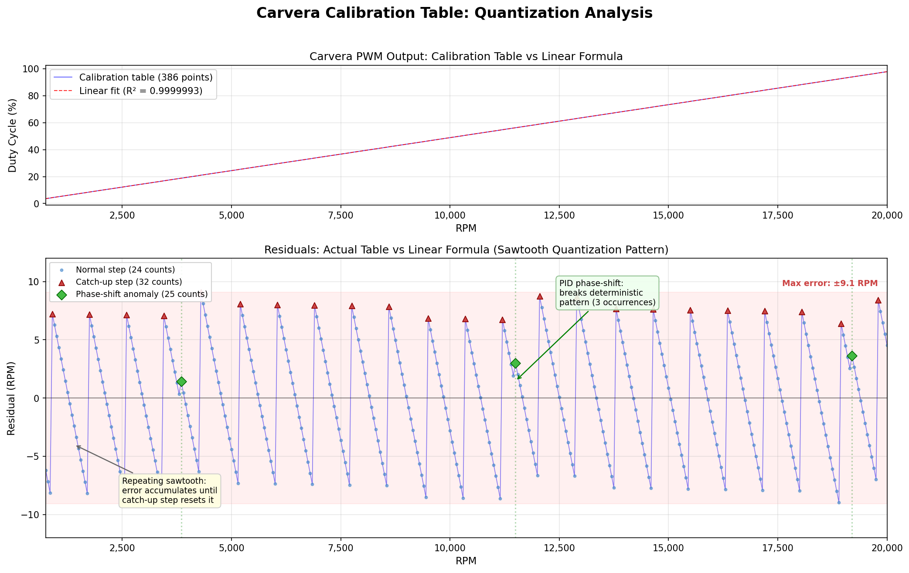

# Carvera Calibration Table: Why a Lookup Table Is Required

## Purpose

Documents why the Carvera-to-Pico PWM signal path requires a 386-point calibration lookup table, unlike the [ESCON 50/5](escon_calculation_validation.md) which was validated as perfectly linear and replaced with a direct formula.

Due to system noise and the measurement resolution of both the Carvera and the ESCON, a linear formula alone would produce RPM readings within an acceptable tolerance for machining purposes (max error of 9.1 RPM, well within the ESCON's own 15.6 RPM quantization noise). However, for an accurate readout on the Pico that is not off by a few RPM from the commanded value, the calibration lookup table is necessary. A user commanding 2000 RPM expects to see 2000 RPM on the display, not 1998 or 2002.

## Background

The Carvera CNC uses a closed-loop PID controller to regulate spindle speed. It outputs a PWM signal encoding the target RPM, which the Pico measures and translates for the ESCON motor controller. To convert measured duty back to RPM, the Pico needs to know the exact relationship between duty and RPM as the Carvera expresses it.

## Methodology

- **Calibration sweep**: 386 points from 750 to 20,000 RPM in 50 RPM steps
- **Capture**: Pico PIO state machine measures Carvera PWM duty at 150 MHz clock resolution
- **Recording window**: 80ms per step with 10ms settle time, multiple samples averaged
- **Analysis**: Linear regression and residual analysis on captured data

## Linear Regression Results

| Metric | Value |
|--------|-------|
| Data points | 386 |
| RPM range | 750 - 20,000 |
| Duty range | 360 - 9,787 (0-10,000 scale) |
| R-squared | 0.9999993 |
| Residual std dev | 2.34 duty counts (4.78 RPM) |
| Max residual | 4.45 duty counts (9.1 RPM) |

The R-squared value is extremely high (even better than the ESCON's 0.99999819), confirming the Carvera's output is fundamentally linear. The best-fit formula is:

```
duty = 0.489441 × RPM - 4.04
```

Predicting a maximum RPM at 100% duty of 20,440 RPM, matching the firmware constant `CARVERA_MAX_RPM = 20437`.

## Why a Formula Alone Is Insufficient

Despite the excellent linear fit, the Carvera's PID controller quantizes its PWM output to integer duty counts. This creates a repeating sawtooth error pattern that no single linear formula can reproduce.

### Step Size Quantization

Each 50 RPM step should produce a duty change of **24.47 counts**, but integer quantization forces three distinct step sizes:

| Step Size | Occurrences | Meaning |
|-----------|-------------|---------|
| 24 | 359 (93.2%) | Normal floor of 24.47 |
| 32 | 23 (6.0%) | Catch-up correction every ~850 RPM |
| 25 | 3 (0.8%) | PID phase-shift anomaly |

The 24-count and 32-count steps form a predictable Bresenham-style rasterization pattern: the fractional error of 0.47 accumulates each step, and after approximately 17 steps (~850 RPM), a catch-up step of 32 (24 + 8) resets the accumulated error.

### The Phase-Shift Anomalies

Three points in the table break the otherwise deterministic pattern:

| RPM | Duty | Step | Effect |
|-----|------|------|--------|
| 3,850 | 1,881 | 25 | Shifts residual phase by +1 count |
| 11,500 | 5,626 | 25 | Shifts residual phase by +1 count |
| 19,200 | 9,395 | 25 | Shifts residual phase by +1 count |

These occur approximately every 7,650 RPM and are caused by the Carvera's PID controller settling to a slightly different equilibrium at these operating points. They are real-world analog effects that cannot be predicted by any purely mathematical formula.

### Formula Reproduction Attempts

| Approach | Mismatches | Max Error |
|----------|-----------|-----------|
| Bresenham integer line | 335 / 386 | 7 duty counts |
| Best integer formula (brute force) | 337 / 386 | 4 duty counts |
| Hardware PWM emulation model | 333 / 386 | 8 duty counts |

No deterministic formula was found that exactly reproduces all 386 calibration points.

## Comparison with ESCON Validation

| Property | ESCON 50/5 | Carvera PWM |
|----------|-----------|-------------|
| R-squared | 0.99999819 | 0.99999927 |
| Residual std | 4.8 RPM | 4.78 RPM |
| Source of residuals | ESCON speed quantization (1/64) | Integer duty quantization + PID |
| Pattern | Random noise | Deterministic sawtooth + anomalies |
| Formula sufficient? | **Yes** — noise is random, averages out | **No** — quantization is systematic |

The ESCON's residuals are random noise from its internal speed quantization, centered on the true value and averaging to zero. A formula gives the correct answer on average. The Carvera's residuals follow a systematic sawtooth pattern that biases the error in one direction for up to 17 consecutive points. A formula consistently under- or over-reports RPM by up to 9.1 RPM in these regions.

## Reference



The upper plot shows the calibration table overlaid with the linear fit — visually indistinguishable at full scale. The lower plot reveals the sawtooth quantization pattern in the residuals, with catch-up steps (red triangles) resetting the accumulated error and phase-shift anomalies (green diamonds) disrupting the deterministic pattern.

## Conclusion

The Carvera calibration lookup table (386 points, 1,544 bytes of flash) is required to faithfully reproduce the Carvera's actual PWM output. While a linear formula achieves an R-squared of 0.9999993, the systematic quantization pattern introduces up to 9.1 RPM of directional error that would cause the displayed RPM to differ from the commanded value. The lookup table eliminates this discrepancy entirely through piecewise-linear interpolation of the measured calibration data.
