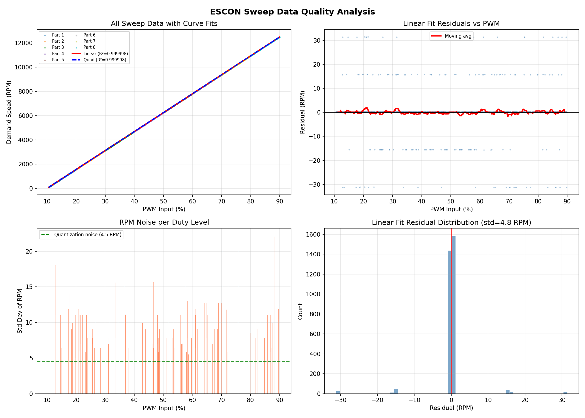

# ESCON 50/5 Linear Formula Validation

## Purpose

Documents how we validated that the ESCON 50/5 servo controller has a perfectly linear PWM-to-RPM mapping, allowing replacement of a 251-point calibration lookup table with a direct formula.

## Methodology

- **8-part duty sweep**: 10.0% to 90.0% in 0.1% steps (800 total points)
- **Dwell time**: 700ms per step (sufficient for ESCON speed regulation)
- **Recording**: ESCON Studio Data Recorder captured actual RPM at each duty setpoint
- **Analysis**: Linear regression on collected data (`data/analyze_sweeps.py`)

## Results

| Metric | Value |
|--------|-------|
| R-squared | 0.99999819 |
| Residual std dev | 4.8 RPM |
| ESCON quantization | 15.6 RPM (matches 1/64 of max speed) |

The residual standard deviation (4.8 RPM) is well within the ESCON's own speed quantization noise (15.6 RPM), confirming the relationship is perfectly linear.

## Formula

From regression:
```
RPM = 156.25 * PWM% - 1562.6
```

Rearranged for duty calculation:
```
duty = motor_rpm / 15.625 + 100
```

## Integer Implementation

The formula is implemented in `src/conversion.rs` as `motor_rpm_to_output_duty()`:

```rust
duty = (motor_rpm - min_rpm) * 800 / (max_rpm - min_rpm) + 100
```

With `config::MIN_RPM = 0` and `config::MAX_RPM = 12500` (from `src/state.rs`), this produces:
- 0 RPM -> duty 100 (10.0%)
- 6250 RPM -> duty 500 (50.0%)
- 12500 RPM -> duty 900 (90.0%)

## Reference



## How to Re-validate

1. Run ESCON sweeps using the 8-part GCode files
2. Export CSV from ESCON Studio Data Recorder
3. Run `python data/analyze_sweeps.py` on collected data
4. Verify R-squared > 0.9999 and residual std < 10 RPM
